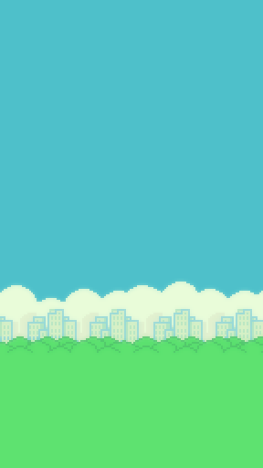
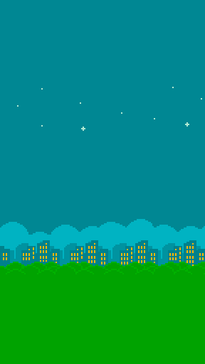
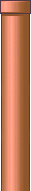
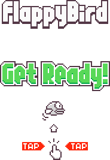
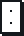
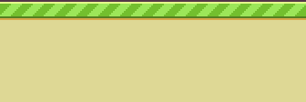

<div align="center">


# 🐤 Flappy Shosh

**Flappy Bird, but the bird is Nataf's head.**

Tap. Flap. Shosh. Try not to faceplant into a pipe.

[](https://adirbuskila.github.io/flappy-shosh/)

[**🎮 Play it live →**](https://adirbuskila.github.io/flappy-shosh/)

</div>

---

## 👀 What is this?

A pixel-perfect [Flappy Bird](https://en.wikipedia.org/wiki/Flappy_Bird) clone built in **vanilla HTML5 Canvas** — zero dependencies, zero build step, one `game.js` file. The twist: the bird is a cut-out photo of **Nataf's smiling head**, flapping its way through the classic green-and-red pipes.

Every flap plays a triumphant **"shosh"** 🔊.

<div align="center">

| The hero | The world |
|:---:|:---:|
|  |   |
| *Shosh, mid-flap* | *Day & night skies (random each run)* |

</div>

## 🕹️ How to play

| Action | Input |
|---|---|
| **Shosh** (flap) | `Space` · `↑` · `W` · Click · Tap |
| **Start** | Any input on the Get-Ready screen |
| **Restart** | Tap after the death animation |

Fly Shosh through the gaps. Each pipe cleared is **+1**. Hit a pipe or the ground and it's game over — but your **best score is saved** between sessions.

## 🏅 Medals

Survive long enough and Shosh earns a medal — his own face, framed in metal:

<div align="center">

|  Tier | Score |
|:---|:---:|
| 🥉 **Bronze** | 10+ |
| 🥈 **Silver** | 20+ |
| 🥇 **Gold** | 30+ |
| 💎 **Platinum** | 40+ |

</div>

## ✨ Features

- 🎨 **Authentic Flappy Bird sprites** — pipes, ground, day/night backgrounds, bitmap digits
- 🔊 **Sound effects** — the signature "shosh" flap, plus point, hit, and die sounds
- 🎲 **Randomized runs** — random background and pipe color (green/red) every game
- 🏆 **Persistent high score** via `localStorage`
- 📱 **Mobile-ready** — responsive scaling, touch controls, locked zoom
- ⚙️ **Frame-rate independent physics** — delta-normalized to 60fps so it feels right on any display
- 🎭 **The little touches** — idle bob on the menu, velocity-based rotation, a white crash flash, and Shosh dramatically tumbling to the ground when he dies

## 🧱 The sprite cast

<div align="center">



&nbsp;&nbsp;



<br/>





<br/>



</div>

## 🛠️ Tech stack

| | |
|---|---|
| **Rendering** | HTML5 Canvas 2D (logical resolution 288×512) |
| **Language** | Plain JavaScript — no frameworks, no bundler |
| **Audio** | Web `Audio`, cloned per-play for overlapping sounds |
| **Storage** | `localStorage` for the high score |
| **Hosting** | GitHub Pages |

## 🚀 Run it locally

It's a static site — no install needed. Just serve the folder:

```bash
git clone https://github.com/AdirBuskila/flappy-shosh.git
cd flappy-shosh

# any static server works, e.g.:
python -m http.server 8000
# then open http://localhost:8000
```

> A server (rather than opening `index.html` directly) is recommended so the audio and image assets load cleanly.

## 📁 Project structure

```
flappy-shosh/
├── index.html          # canvas + loading screen
├── game.js             # the whole game (physics, render, input, audio)
├── style.css           # responsive layout & scaling
└── assets/
    ├── nataf.png       # Shosh, the star
    ├── shosh.ogg       # the flap sound
    ├── audio/          # point, hit, die, swoosh
    └── sprites/        # pipes, backgrounds, ground, digits, UI
```

---

<div align="center">

Made with ❤️ and a lot of shoshing.


</div>
